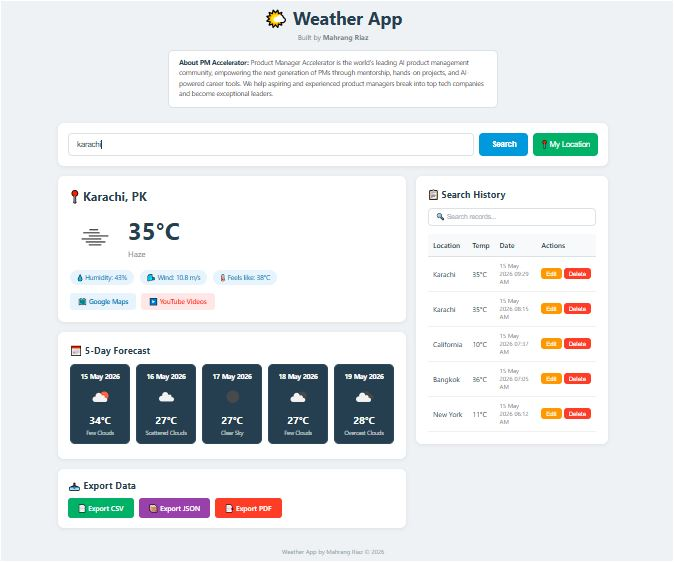
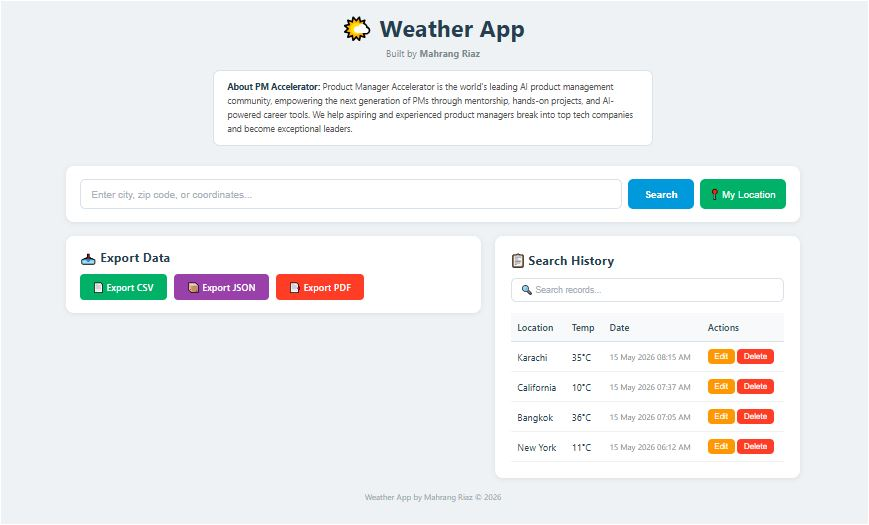

# 🌤️ Weather App

**Built by Mahrang Riaz | PM Accelerator**

> Product Manager Accelerator is the world's leading AI product management community, empowering the next generation of PMs through mentorship, hands-on projects, and AI-powered career tools to break into top tech companies.

---




---

## Features

- 🔍 Search weather by city, zip code, or coordinates
- 📍 Current location detection (GPS)
- 🌡️ Temperature toggle (°C / °F)
- 📅 5-Day forecast
- 🗓️ Date range search with validation
- 🗺️ Google Maps integration
- ▶️ YouTube travel videos integration
- 📋 Full CRUD — Create, Read, Update, Delete search history
- 📥 Export data as CSV, JSON, PDF, XML, Markdown

---

## Tech Stack

- **Frontend:** React.js
- **Backend:** Python Flask
- **Database:** SQLite
- **API:** OpenWeatherMap

---

## How to Run

### Backend
```bash
cd backend
pip install -r requirements.txt
python app.py
```

Create a `.env` file in the backend folder:
```
WEATHER_API_KEY=your_api_key_here
```

### Frontend
```bash
cd frontend
npm install
npm start
```

Get a free API key at [openweathermap.org](https://openweathermap.org/api)

---

*Weather App by Mahrang Riaz | PM Accelerator © 2026*
